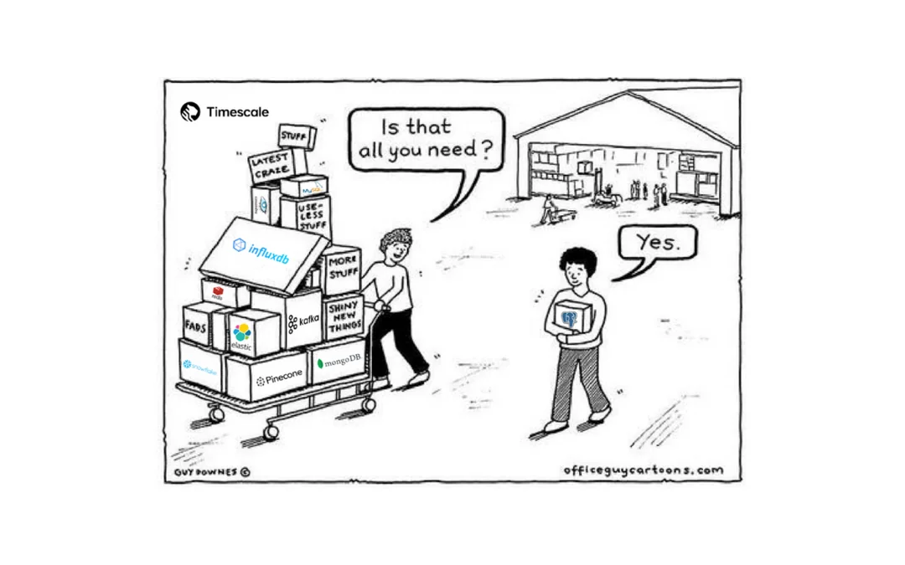
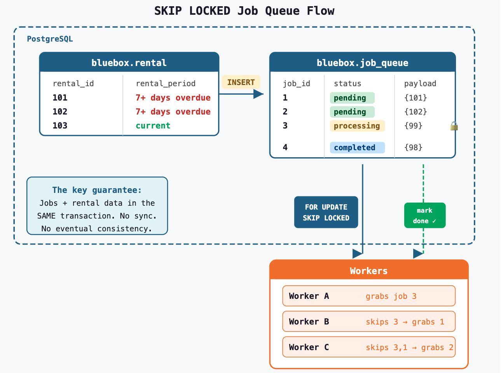

theme: Poster, 1
slidenumbers: true
footer: **Just Use Postgres** | KCDC 2026 | @sqlliz


---

# Just Use Postgres: 
# A Strategy for Modern Apps


---


---

# About Me

### Elizabeth Christensen
- Developer Advocate @ Snowflake
- PostgreSQL contributor & pgUS Board Member
- KC Postgres + Postgres Meetup for All 


---




---


---

# Data tools and possible consolidation

| Need | "Proper" Tool |
|------|--------------|
| Job queues | Redis, Sidekiq, Celery |
| Events/Pub-Sub | Kafka, RabbitMQ |
| Caching | Redis, Memcached |
| Document store | MongoDB |
| Spatial | Esri / ArcGIS |
| Graph DB | Neo4j |
| Vector search | Pinecone |
| Full-text search | Elasticsearch |
| OLAP | ClickHouse, DuckDB |

---

# The Question

Can Postgres actually replace these?

**Spoiler:** Sometimes yes, sometimes "it depends"

---

# Our Pattern Today

1. **The problem** — what do you need?
2. **The usual tool** — what people reach for
3. **The Postgres way** — how PG does it
4. **Code examples** — using Bluebox data
5. **Tradeoffs** — when to stay, when to leave


---

# Talk slides and markdown

[.column]

- `github.com/sfc-gh-echristensen/bluebox`

[.column]


---

# Our Demo Data: Bluebox

- Movie rental database (think: Redbox but blue 🐘)
- Real TMDB movie data, PostGIS geography
- Film metadata with JSONB, tsvector, arrays
- [Bluebox Postgres sample data](https://github.com/ryanbooz/bluebox)
- More at [Postgres Full Day Training](https://github.com/Snowflake-Labs/postgres-full-day-training)

---

# Bluebox Schema 

```sql
bluebox.film       -- title, overview, tsvector, JSONB
bluebox.customer   -- full_name, email, geog (PostGIS)
bluebox.store      -- street_name, geog (PostGIS)
bluebox.rental     -- rental_period (tstzrange)
bluebox.payment    -- amount, payment_date
bluebox.inventory  -- film_id, store_id
bluebox.person     -- actors/crew
bluebox.film_cast  -- film ↔ person relationships
```

---

[.header: alignment(center)]

# Extensibility
## Why Postgres can do all this

---

# The Original Vision

> "The Postgres data model ... provides the user with a powerful and flexible tool ... the system is **extensible** by the user in every way."
> — Stonebraker & Rowe, 1986

^ This quote is from the original POSTGRES paper by Michael Stonebraker and Lawrence Rowe at UC Berkeley in 1986. Extensibility was literally the founding design principle — not an afterthought. This is why Postgres can absorb new data models (spatial, graph, vector) without forking.

---

# Extensions vs. Forks

| Approach | Examples | Tradeoff |
|----------|----------|----------|
| Core | tsvector, JSONB, ranges | Always available |
| Contrib | pg_trgm, hstore, pg_stat_statements | Ships with PG |
| Extensions | PostGIS, pgvector, TimescaleDB | Install separately |
| Forks | Yugabyte, Citus | Powerful, but moves away from core PG  |

---

# Installing an Extension

```sql
-- It's this easy
CREATE EXTENSION IF NOT EXISTS postgis;
CREATE EXTENSION IF NOT EXISTS pg_trgm;
CREATE EXTENSION IF NOT EXISTS vector;

-- See what you have
SELECT * FROM pg_available_extensions
WHERE installed_version IS NOT NULL;
```

---

# Popular extensions 

- **PostGIS** — spatial 
- **pgvector** — embeddings & similarity search
- **Citus** — sharding 
- **TimescaleDB** — time series hypertables
- **Apache AGE** — graph queries (Cypher)
- **pg_cron** — scheduled jobs

---


[.header: alignment(center)]

# Job Queues
## SKIP LOCKED & Advisory Locks

---

# The Problem: Overdue Rentals

- DVDs are 7+ days overdue — need to process return notices
- Multiple workers handling notices, can't double-send
- If a notice fails, retry it automatically
- Jobs and rental data live in the same database

---

# Job Queues: The Usual Suspects

- **Redis + Sidekiq** (Ruby)
- **Redis + BullMQ** (Node.js)
- **Celery + RabbitMQ/Redis** (Python)
- **Amazon SQS**

All require a separate service to operate.

---

## Postgres 'FOR UDPATE' 'SKIP LOCKED'



---

# Create a Job Queue Table


```sql
CREATE TABLE bluebox.job_queue (
    job_id BIGSERIAL PRIMARY KEY,
    job_type TEXT NOT NULL,
    payload JSONB,
    status TEXT DEFAULT 'pending',
    created_at TIMESTAMPTZ DEFAULT now(),
    attempted_at TIMESTAMPTZ,
    attempts INT DEFAULT 0
);
```

^ It's just a table. No special infrastructure — a regular Postgres table sitting next to your rental and payment data. The magic is in how you read from it.

---

# Move things to the process table

```sql
-- Queue up overdue rental returns
INSERT INTO bluebox.job_queue (job_type, payload)
SELECT 'process_return',
    jsonb_build_object(
        'rental_id', rental_id,
        'customer_id', customer_id,
        'days_overdue', EXTRACT(DAY FROM now() - upper(rental_period))
    )
FROM bluebox.rental
WHERE upper(rental_period) < now() - interval '7 days'
  AND rental_id NOT IN (
      SELECT (payload->>'rental_id')::int FROM bluebox.job_queue
      WHERE job_type = 'process_return'
  );
```

---

# Claim a Job (SKIP LOCKED)

```sql
-- Worker grabs ONE job, skipping locked rows
UPDATE bluebox.job_queue
SET status = 'processing',
    attempted_at = now(),
    attempts = attempts + 1
WHERE job_id = (
    SELECT job_id FROM bluebox.job_queue
    WHERE status = 'pending'
    ORDER BY created_at
    FOR UPDATE SKIP LOCKED
    LIMIT 1
)
RETURNING *;
```


---

# Step 4: To the work and upate

```sql
-- Success
UPDATE bluebox.job_queue SET status = 'completed' WHERE job_id = 123;
```

---

# Job queue libraries

- [**GoodJob**](https://github.com/bensheldon/good_job) (Ruby/Rails) — PG-backed ActiveJob
- [**Solid Queue**](https://github.com/rails/solid_queue) (Rails 8 default) — SKIP LOCKED
- [**PgQueuer**](https://github.com/janbjorge/pgqueuer) (Python) — LISTEN/NOTIFY + SKIP LOCKED
- [**Graphile Worker**](https://github.com/graphile/worker) (Node.js) — advisory locks
- [**Que**](https://github.com/que-rb/que) (Ruby) — advisory locks, 10K jobs/sec

---

# Job Queue Benchmarks

- [**Que**](https://gist.github.com/chanks/7585810) — 10,000 jobs/sec with PostgreSQL advisory locks
- [**Graphile Worker**](https://github.com/graphile/worker) — sub-3ms dispatch latency, 100-200 jobs/sec on typical hardware

---

# Job Queues: Tradeoffs

^ The 50K/min threshold is a rough guideline. Most web apps process well under this. If you're a startup or small team, the operational simplicity of keeping jobs in Postgres is almost always worth the throughput tradeoff.

| Postgres | Use Redis/SQS when... |
|------------|------------------------|
| ~50K jobs/min | ~100K jobs/min |
| Transactional consistency | Ultra-low latency needed |
| One less service | Advanced routing/priorities |
| Same backups, same monitoring | Multi-region distribution |
| Your data and jobs are atomic | Job payload > few KB |

---


[.header: alignment(center)]

# Events & Pub/Sub
## LISTEN / NOTIFY

---

# The Problem: Real-Time Rental Alerts

- New rental comes in — update the store dashboard instantly
- Notify the inventory system when stock changes
- Trigger a receipt email without polling


---

# Events: The Usual Suspects

- **Apache Kafka** — event streaming at scale
- **Redis Pub/Sub** — fast, ephemeral
- **RabbitMQ** — message routing
- **AWS SNS/SQS** — managed cloud

---

# Postgres Has: LISTEN / NOTIFY

^ LISTEN/NOTIFY is dead simple but people underestimate it. The key pattern: use it for signaling ("something happened"), not for transporting large payloads. Think of it as a nudge, not a message bus.

```sql
-- Session 1: Subscribe to a channel
LISTEN new_rental;

-- Session 2: Publish an event
NOTIFY new_rental, '{"customer": "Jane", "film": "Inception"}';

-- Session 1 receives:
-- Asynchronous notification "new_rental" with payload
-- "{"customer": "Jane", "film": "Inception"}"
```

---


---


# Auto-Notify on INSERT via Trigger

```sql
CREATE TRIGGER rental_notify
    AFTER INSERT ON bluebox.rental
    FOR EACH ROW EXECUTE FUNCTION notify_new_rental();

CREATE OR REPLACE FUNCTION notify_new_rental()
RETURNS TRIGGER AS $$
BEGIN
    PERFORM pg_notify('new_rental',
        json_build_object(
            'rental_id', NEW.rental_id,
            'customer_id', NEW.customer_id,
            'inventory_id', NEW.inventory_id,
            'rented_at', lower(NEW.rental_period)
        )::text
    );
    RETURN NEW;
END;
$$ LANGUAGE plpgsql;
```

^ We create a trigger function that fires after every INSERT on the rental table. It calls pg_notify with a channel name and a JSON payload built from the NEW row. Any client LISTENing on 'new_rental' receives this payload instantly. PERFORM is used instead of SELECT because we don't need the return value.

---

# Listening in Application Code (Python)

```python
import psycopg2
import select

conn = psycopg2.connect("dbname=bluebox")
conn.autocommit = True
cur = conn.cursor()
cur.execute("LISTEN new_rental;")

while True:
    select.select([conn], [], [], 5)  # 5s timeout
    conn.poll()
    while conn.notifies:
        notify = conn.notifies.pop(0)
        print(f"New rental: {notify.payload}")
        # Send webhook, update cache, etc.
```

^ On the listener side, the Python app opens a connection with autocommit=True (required for LISTEN to work), subscribes to the channel, then blocks on select() waiting for notifications. When Postgres delivers one, conn.poll() populates the notifies queue. This is a persistent connection — it stays open for the lifetime of the listener.

---

# Real-World: Forem (dev.to)

> "We considered building pub/sub on Redis, on Pusher or any other third party system but for the scope of this feature we decided against it."
> — Forem GitHub Issue #3715

^ Forem is the open-source platform behind dev.to, one of the largest developer communities. They chose PostgreSQL LISTEN/NOTIFY for webhook delivery over Redis or a third-party service because it eliminated an external dependency and the message volume was well within PG's limits.

They chose PostgreSQL LISTEN/NOTIFY for webhook delivery.
[github.com/forem/forem/issues/3715](https://github.com/forem/forem/issues/3715)

---

# Limits of Postgres Listen/Notify

- **~1,000 notifications/sec** sustained max
- Payload size limited to **8,000 bytes**
- Listeners need **persistent connections**
- Messages are **fire-and-forget** (not durable)
- Single instance only (no replication)

---

# For Durable Events: CDC

If you need guaranteed delivery, look at:

- **Debezium** — reads WAL, writes to Kafka
- **Postgres logical replication** — built-in replication


---

# Listen/Notify: Tradeoffs

- Scaling
- Message durability
- Singe client vs patterned subscriptions

---

# Going Further: pgsql-http 

```sql
-- Send actual HTTP webhooks from inside Postgres!
CREATE EXTENSION http;

-- POST a webhook from a trigger
CREATE OR REPLACE FUNCTION webhook_on_rental()
RETURNS TRIGGER AS $$
BEGIN
    PERFORM http_post(
        'https://api.example.com/webhooks/rental',
        json_build_object(
            'event', 'new_rental',
            'rental_id', NEW.rental_id,
            'customer_id', NEW.customer_id
        )::text,
        'application/json'
    );
    RETURN NEW;
END;
$$ LANGUAGE plpgsql;
```

^ Why is this in the Events section? LISTEN/NOTIFY is great for signaling between Postgres and your application, but it can't reach the outside world — it only works over a Postgres connection. pgsql-http fills that gap: instead of NOTIFY → app listener → HTTP call, you can fire an HTTP webhook directly from a trigger, cutting out the middleware entirely. https://github.com/pramsey/pgsql-http.

---

# pg_eventserv: WebSockets from Postgres

- Bridges LISTEN/NOTIFY to **WebSockets** for web clients
- Real-time maps, dashboards, auction systems, fleet tracking
- Zero application middleware — events go DB → browser
- Crunchy Data open-source project

^ https://github.com/CrunchyData/pg_eventserv — A lightweight Go microservice (~200 GitHub stars) that does one thing: takes NOTIFY payloads and pushes them to WebSocket clients. Part of Crunchy Data's "PostGIS for the Web" (PostGIS FTW) stack. Great for real-time maps, dashboards, live bidding systems. Zero application middleware needed.


---


[.header: alignment(center)]

# Caching & Key-Value
## UNLOGGED Tables

---

# The Problem: Slow Film Catalog

- The "Top Rentals" page queries rentals + films + inventory every load
- Same 100 popular films served thousands of times per hour
- Data only needs to be fresh-ish — hourly is fine
- **Idea:** pre-compute the result, serve from a fast lookup table
- Don't want to add Redis just for this

---

# Caching: The Usual Suspects

- **Redis / Valkey** — in-memory, sub-millisecond
- **Memcached** — simple KV cache
- **Application-level caches** — in-process

---


^ The pattern: run the expensive multi-table join once (on a schedule), store the result as JSONB in an UNLOGGED table keyed by a simple string, then serve requests with a single key lookup instead of re-running the join. pg_cron refreshes it hourly. The UNLOGGED table is faster because it skips WAL writes — same tradeoff as Redis (data lost on crash, but it's a cache so you just rebuild it).

---

# Postgres Has: UNLOGGED Tables

```sql
-- An UNLOGGED table skips WAL (Write-Ahead Log)
-- = Faster writes, but data is LOST on crash
-- Sound familiar? That's exactly how Redis works!

-- Your "cache" IS a table. Key-value pairs.
CREATE UNLOGGED TABLE bluebox.cache (
    cache_key TEXT PRIMARY KEY,     -- the "key"
    cache_value JSONB NOT NULL,     -- the "value" (any shape)
    expires_at TIMESTAMPTZ NOT NULL -- TTL
        DEFAULT now() + interval '1 hour'
);

CREATE INDEX idx_cache_expires ON bluebox.cache (expires_at);
```

^ This is a real Postgres table — you query it with SQL, join it with other tables, and use all normal indexing. UNLOGGED tables skip the Write-Ahead Log, which means writes are significantly faster but data is lost on crash. This is the exact same tradeoff Redis makes — it's an in-memory store that can persist to disk but loses recent writes on crash. The index speeds up the big deletes when the cache expires.

---

# Regular Table vs Cache Table

```
 ┌─ bluebox.film (LOGGED, normal table) ──────────────┐
 │ film_id │ title          │ popularity │ vote_avg    │
 │─────────│────────────────│────────────│─────────────│
 │ 550     │ Fight Club     │ 73.4       │ 8.4         │
 │ 680     │ Pulp Fiction   │ 88.1       │ 8.5         │
 └─────────────────────────────────────────────────────┘
      ↑ WAL-protected, crash-safe, replicated

 ┌─ bluebox.cache (UNLOGGED, cache table) ────────────┐
 │ cache_key      │ cache_value (JSONB)   │ expires_at │
 │────────────────│───────────────────────│────────────│
 │ film:550       │ {"title":"Fight Club"}│ 2026-09-01 │
 │ top_rentals:NY │ [{"film_id":550},...] │ 2026-08-31 │
 └─────────────────────────────────────────────────────┘
      ↑ NO WAL, fast writes, LOST on crash (like Redis)
```

Both are queryable with SQL. Both support indexes. The difference is durability.

---

# Basic Cache Operations

```sql
-- SET (upsert)
INSERT INTO bluebox.cache (cache_key, cache_value, expires_at)
VALUES ('film:550', '{"title":"Fight Club","rating":8.4}',
        now() + interval '24 hours')
ON CONFLICT (cache_key) DO UPDATE
SET cache_value = EXCLUDED.cache_value,
    expires_at = EXCLUDED.expires_at;

-- GET
SELECT cache_value FROM bluebox.cache
WHERE cache_key = 'film:550'
  AND expires_at > now();

-- DELETE expired
DELETE FROM bluebox.cache WHERE expires_at < now();
```

^ These are the three basic cache operations mapped to SQL. SET uses INSERT ... ON CONFLICT to upsert — if the key exists, it updates the value and resets the TTL. GET filters on expires_at so stale entries are never returned. DELETE cleans up expired rows — you'd run this periodically with pg_cron.

---

# Bluebox: Cache Popular Films

```sql
-- Warm the cache with top-rented films
INSERT INTO bluebox.cache (cache_key, cache_value)
SELECT
    'popular_film:' || f.film_id,
    jsonb_build_object(
        'title', f.title,
        'popularity', f.popularity,
        'rental_count', count(r.rental_id)
    )
FROM bluebox.film f
JOIN bluebox.inventory i USING (film_id)
JOIN bluebox.rental r USING (inventory_id)
GROUP BY f.film_id
ORDER BY count(r.rental_id) DESC
LIMIT 100
ON CONFLICT (cache_key) DO UPDATE
SET cache_value = EXCLUDED.cache_value;
```

^ This query pre-warms the cache by joining films to rentals, counting rental frequency, and inserting the top 100 as JSONB objects. The ON CONFLICT clause makes it safe to re-run — it just refreshes existing entries. You'd schedule this with pg_cron to keep the cache warm hourly.

---

# Caching: Tradeoffs

- scaling and read loads
- more cache types
- using cache keys for pub/sub 
- limited to Postgres SQL features for management


---


[.header: alignment(center)]

# Document Store & APIs
## JSONB

---

# The Problem: Messy Film Credits

- TMDB API returns cast and crew as nested JSON arrays
- Each film has a different number of actors, directors, producers
- Need to search inside these arrays ("find all Tom Hanks films")
- Don't want a separate document store for one API's data

---

# Document Store: The Usual Suspects

- **MongoDB** — document-first database
- **CouchDB** — JSON + HTTP API
- **DynamoDB** — AWS managed NoSQL

---

# Why NoSQL Got Popular

1. **Schema flexibility** — no ALTER TABLE migrations
2. **Developer speed** — people loved  JSON when it came out
3. **APIs** — obvs
3. **Postgres features were limited** - lots of support has been added over the last decade


---

# Postgres Has: JSONB

```sql
-- Different "schemas" in the SAME table, SAME column
-- This is the MongoDB appeal — and JSONB does it too
CREATE TABLE bluebox.api_events (
    id BIGSERIAL PRIMARY KEY,
    event_type TEXT,
    payload JSONB
);

INSERT INTO bluebox.api_events (event_type, payload) VALUES
('signup', '{"user": "jane", "plan": "pro", "referral": "google"}'),
('purchase', '{"user": "jane", "items": [{"sku": "DVD-001", "qty": 2}],
              "total": 9.99, "coupon": null}'),
('support', '{"user": "jane", "ticket_id": 4521,
              "tags": ["billing", "urgent"],
              "metadata": {"browser": "Chrome", "os": "macOS"}}');
```

---

# JSONB Operators

| Operator | Returns | Example |
|----------|---------|---------|
| `->` | JSON object | `payload->'metadata'` |
| `->>` | Text value | `payload->>'user'` → `'jane'` |
| `->0` | Array element | `"cast"->0` (first item) |
| `@>` | Containment match | `"cast" @> '[{"name":"Tom Hanks"}]'` |
| `?` | Key exists? | `payload ? 'tags'` |
| `jsonb_array_elements()` | Unnest array to rows | `FROM jsonb_array_elements("crew")` |
| `jsonb_array_length()` | Array size | `jsonb_array_length("cast")` |

Chain them: `payload->'items'->0->>'sku'`

^ The key distinction: single arrow (->) returns a JSON object you can keep drilling into, double arrow (->>) returns text for display or comparison. The containment operator (@>) checks if a JSONB value contains a given structure — great for searching inside arrays. jsonb_array_elements unnests a JSON array into rows so you can filter with normal WHERE clauses. All operators except ->> are indexable with GIN.


---

# Generalized Inverted Indexes (GIN) for JSONB

```sql
-- Index the entire JSONB document
CREATE INDEX idx_credits_cast_gin
ON staging.film_credits USING GIN ("cast");

-- Now containment queries are fast!
-- This uses the index:
SELECT film_id FROM staging.film_credits
WHERE "cast" @> '[{"name": "Scarlett Johansson"}]';
```

^ A GIN index on a JSONB column indexes every key and value in the document. Containment queries (@>) use this index automatically — so searching for an actor name inside an array of hundreds of cast members is fast, not a sequential scan. This is the Postgres equivalent of MongoDB's multi-key index.

---

# Bluebox: Flexible Film Metadata

```sql
-- Store API response data alongside relational
-- Real pattern: keep structure for queries, JSONB for the rest

SELECT f.title, f.release_date,
    fc."cast"->0->>'name' AS star,
    jsonb_array_length(fc."cast") AS cast_size,
    jsonb_array_length(fc."crew") AS crew_size
FROM bluebox.film f
JOIN staging.film_credits fc USING (film_id)
WHERE f.popularity > 100
ORDER BY f.popularity DESC
LIMIT 10;
```

^ This is the real-world pattern: relational columns (title, release_date, popularity) for structured queries and filtering, JSONB columns (cast, crew) for the flexible parts. You get the best of both worlds — SQL indexes on your structured data, GIN indexes on your documents, and JOINs between them.

---

# Search with regex jsonb_path

```sql
-- JSONPath: powerful querying inside documents
SELECT film_id,
    jsonb_path_query_array(
        "cast",
        '$[*] ? (@.name like_regex "^Tom")'
    ) AS toms_in_cast
FROM staging.film_credits
WHERE jsonb_path_exists(
    "cast",
    '$[*] ? (@.name like_regex "^Tom")'
)
LIMIT 5;
```


---

# Blog: "I Replaced MongoDB with a Single Postgres Table"

> "Postgres and its JSONB data type can replace MongoDB for most NoSQL use cases. Get schema flexibility, ACID compliance, and fast queries from a single table."
> — userjot.com/blog/postgres-jsonb-vs-mongodb

^ https://userjot.com/blog/postgres-jsonb-vs-mongodb — Full title: "I Replaced MongoDB with a Single Postgres Table." JSONB was introduced in Postgres 9.4 (2014). The binary format stores parsed JSON so you don't re-parse on every read. Also check out pgmongo (https://github.com/thomas4019/pgmongo) — it implements the MongoDB wire protocol on top of Postgres, so MongoDB drivers can talk to PG directly.

---

# Document Store: Tradeoffs

| Postgres JSONB | Use MongoDB when... |
|------------------|----------------------|
| Hybrid relational + document | Pure document workloads |
| ACID across documents | Horizontal sharding from day 1 |
| Joins between JSON & tables | > 1TB of documents |
| One database to operate | Aggregation pipeline preferred |
| GIN indexes are fast | Write-heavy, high cardinality |

---


[.header: alignment(center)]

# Spatial Data
## PostGIS

---

# Points, Lines, Polygons


^ https://en.wikipedia.org/wiki/File:GIS_PointsLinesPolygons.PNG

---

# Geospatial Data in Postgres

```sql
-- Bluebox already has geography columns!
-- customer.geog and store.geog are Point(4326)

SELECT full_name,
    ST_AsText(geog) AS location
FROM bluebox.customer
LIMIT 3;
-- Jane Smith | POINT(-73.9857 40.7484)

-- Which store is closest to customer 42?
SELECT s.store_id, s.street_name,
    round(ST_Distance(c.geog, s.geog)::numeric) AS distance_meters
FROM bluebox.customer c
CROSS JOIN bluebox.store s
WHERE c.customer_id = 42
ORDER BY c.geog <-> s.geog  -- KNN operator!
LIMIT 3;
```

^ Bluebox has geography columns on both customer and store tables. ST_AsText converts the binary format to WKT (Well-Known Text). The <-> operator is the KNN distance operator — uses a GiST spatial index for fast lookup. ST_Distance returns meters with the geography type.

---

# WKB vs Traditional Geo Data

```sql
SELECT st_astext(dms_to_postgis_point('38°58′17″N 95°14′05″W'));

                  st_astext
---------------------------------------------
 POINT(-95.23472222222222 38.97138888888889)
(1 row)
```

^ Well-Known Binary (WKB) is how PostGIS stores geometry internally — a compact binary format that's efficient for indexing and computation. Compare to storing lat/lng as two float columns: you lose spatial indexing, Earth curvature handling, and the entire ST_* function library. Geography type in PostGIS handles great-circle distance on a sphere automatically.

---

# Open Source Geo Stack

| Extensions | Tools & Libraries |
|---|---|
| **PostGIS** — geometry, geography, spatial indexing | **pg_tileserv** — MVT vector tiles from PostGIS |
| **postgis_tiger_geocoder** — US address geocoding | **pg_featureserv** — GeoJSON via OGC API |
| **pgrouting** — shortest path, Dijkstra, A* | **OpenLayers** — JS map library (no API key) |
| **h3-pg** — Uber's hexagonal spatial index | **QGIS** — desktop GIS, native PostGIS connection |
| **pgpointcloud** — LiDAR point cloud storage | **GDAL/OGR** — format conversion, ETL |
| **postgis_raster** — raster data in the DB | **GeoServer** — OGC WMS/WFS server |

^ The Postgres geo ecosystem is massive. postgis_tiger_geocoder ships with PostGIS and geocodes US addresses using TIGER/Line census data — no external API needed. pgRouting adds graph-based routing (Dijkstra, A*, traveling salesman) directly in SQL. h3-pg brings Uber's hexagonal hierarchical index for spatial aggregation. All free, all composable, all inside your existing database.

---

# pg_featureserv → Bluebox Store Map


^ Live demo: pg_featureserv auto-discovers the bluebox.store table, serves GeoJSON at localhost:9000, and an OpenLayers map renders store locations with zero middleware.

---


[.header: alignment(center)]

# Graph Queries
## Property Graph (pg19) & Apache AGE

---

# Graph DBs

- Complex relationships: social networks, fraud detection, knowledge graphs, personalization
- Interconncted data with unknown number of hops between relationships (friend-of-friend )
- Rapid schema changes


---

# Graph vs Relational


---

# Property Graph vs Cypher

| | Property Graph (PG19) | Cypher (Apache AGE) |
|---|---|---|
| Standard | ISO SQL:2023 | openCypher (Neo4j-originated) |
| Storage | View over existing tables | Separate graph store (agtype) |
| Query style | `MATCH (a IS person)-[e IS cast]->(b IS film)` | `MATCH (a:Person)-[:ACTED_IN]->(b:Film)` |
| Variable-length paths | Not yet (PG19) | Yes — `[:ACTED_IN*1..4]` |
| Graph algorithms | No built-in | APOC, GDS (Neo4j) |
| Data loading | Zero — uses your tables | Must import into graph |


---

# The Problem: Actor Connections

- "Fans of Kevin Bacon also watched..." — recommend through cast overlap


---

# Graph Queries: The Usual Suspects

- **Neo4j** — native graph, Cypher language
- **Amazon Neptune** — managed graph
- **PuppyGraph** — graph query layer over existing DBs (no ETL)


---

# The Old Postgres Way: Recursive CTEs

```sql
-- Find actor collaboration chains
WITH RECURSIVE collab AS (
    -- Start: films with actor A
    SELECT fc2.person_id, 1 AS depth
    FROM bluebox.film_cast fc1
    JOIN bluebox.film_cast fc2 USING (film_id)
    WHERE fc1.person_id = 500  -- Tom Hanks
      AND fc2.person_id != 500
    UNION
    -- Recurse: films with those actors...
    SELECT fc2.person_id, c.depth + 1
    FROM collab c
    JOIN bluebox.film_cast fc1 ON fc1.person_id = c.person_id
    JOIN bluebox.film_cast fc2 USING (film_id)
    WHERE fc2.person_id != 500 AND c.depth < 3
)
SELECT DISTINCT person_id, min(depth) FROM collab GROUP BY 1;
```

^ This recursive CTE is the "old way" to do graph traversals in Postgres. It starts with Tom Hanks's co-stars (depth 1), then finds their co-stars (depth 2), and so on. It works, but it's hard to read, hard to debug, and performance degrades quickly past depth 3 because the join fan-out.

---

# Coming soon to Postgres: Property Graphs?

```sql
-- Define a graph over existing tables (it's a VIEW!)
CREATE PROPERTY GRAPH movie_graph
  VERTEX TABLES (
    bluebox.person KEY (person_id)
      PROPERTIES (person_id, name, popularity),
    bluebox.film KEY (film_id)
      PROPERTIES (film_id, title, release_date)
  )
  EDGE TABLES (
    bluebox.film_cast KEY (film_id, person_id)
      SOURCE KEY (person_id) REFERENCES person (person_id)
      DESTINATION KEY (film_id) REFERENCES film (film_id)
      PROPERTIES (film_character)
  );
```

^ CREATE PROPERTY GRAPH defines a graph as a view over existing tables — no new storage. VERTEX TABLES are the nodes (person and film), EDGE TABLES are the relationships (film_cast). The KEY and REFERENCES clauses map to your existing primary and foreign keys. This is ISO SQL:2023 standard syntax.

---

# Property graph: 1 Hop (co-stars)

```sql
SELECT * FROM GRAPH_TABLE (movie_graph
    MATCH (a IS person)-[IS film_cast]->(f IS film)
          <-[IS film_cast]-(b IS person)
    WHERE a.name = 'Kevin Bacon'
      AND b.person_id != a.person_id
    COLUMNS (b.name AS costar, f.title AS film)
) ORDER BY film LIMIT 5;
```

```
 costar             | film
--------------------+----------------------
 Tom Hanks          | Apollo 13
 Andie MacDowell    | Beauty Shop
 John Carroll Lynch | Crazy, Stupid, Love.
 Evan Rachel Wood   | Digging to China
 Kevin Denson       | Footloose
```

^ One hop: person → film ← person. Clean, readable, uses your existing tables and indexes. This is what SQL/PGQ does well.

---

# Property graph: 2 Hops — Kevin Bacon to Sally Field

```sql
-- Must hardcode every node and edge in the chain
SELECT * FROM GRAPH_TABLE (movie_graph
    MATCH (a IS person)-[IS film_cast]->(f1 IS film)
          <-[IS film_cast]-(mid IS person)
          -[IS film_cast]->(f2 IS film)
          <-[IS film_cast]-(b IS person)
    WHERE a.name = 'Kevin Bacon'
      AND b.name = 'Sally Field'
      AND mid.person_id != a.person_id
      AND b.person_id != mid.person_id
      AND mid.popularity > 20
    COLUMNS (f1.title AS film_1, mid.name AS via_actor,
             f2.title AS film_2)
) LIMIT 5;
```

```
 film_1               | via_actor      | film_2
----------------------+----------------+----------------------------------------
 Apollo 13            | Tom Hanks      | Forrest Gump
 Crazy, Stupid, Love. | Emma Stone     | The Amazing Spider-Man
 Hollow Man           | Elisabeth Shue | Soapdish
```


---

## Apache AGE — Cypher in Postgres


- openCypher (Neo4j's query language) as a Postgres extension.
- ASCII pattern matching

() = nodes (entities)
[] = relationships (edges)
-> / <- = direction

```sql
(a)-[:ACTED_IN]->(f)<-[:ACTED_IN]-(b)
```

*[Blog: Graph Queries in Postgres with Apache AGE](https://www.snowflake.com/en/blog/engineering/graph-queries-postgres-apache-age/)*

---

# Apache AGE: Any Depth

```sql
-- Same question, any depth — change one number
SELECT * FROM cypher('movie_graph', $$
    MATCH p = (a:Person)-[:ACTED_IN*1..6]-(b:Person)
    WHERE a.name = 'Kevin Bacon'
      AND b.name = 'Sally Field'
    RETURN length(p) AS hops,
           [n IN nodes(p) | coalesce(n.name, n.title)] AS chain
    ORDER BY hops LIMIT 3
$$) AS (hops agtype, chain agtype);
```

```
 hops | chain
------+--------------------------------------------------------------------
 4    | ["Kevin Bacon","Apollo 13","Tom Hanks","Forrest Gump","Sally Field"]
 6    | ["Kevin Bacon","She's Having a Baby","Bill Murray",
       "Ghostbusters: Afterlife","Olivia Wilde","Her","Sally Field"]
```

---

# Choosing a graph only db

- Is your entire data model a graph? 
- Do you need complex algorithms and deep traversals? 
- If you just have one graph thing, try Postgres as a start


---


[.header: alignment(center)]

# AI & Vector Search
## pgvector

---

# The Problem: "Films Like This"

- Customer describes what they want: "a heist movie with a clever twist"
- Keyword search fails — need meaning, not exact words
- Recommend films similar to one they just watched
- Combine similarity with filters: "sci-fi from the 2020s"

---

# Vector Search: The Usual Suspects

- **Pinecone** — managed vector DB
- **Weaviate** — open-source vector DB
- **LanceDB** - open-source serverless vector DB

---

# Postgres Has: pgvector

```sql
CREATE EXTENSION vector;

-- Add embedding column to films
ALTER TABLE bluebox.film
ADD COLUMN embedding vector(1536);  -- OpenAI dimensions

-- Create HNSW index for fast similarity
CREATE INDEX ON bluebox.film
USING hnsw (embedding vector_cosine_ops);
```

---

# Similarity Search

```sql
-- Find films similar to a query embedding
SELECT title, overview,
    1 - (embedding <=> $1) AS similarity
FROM bluebox.film
WHERE embedding IS NOT NULL
ORDER BY embedding <=> $1  -- cosine distance
LIMIT 5;

-- $1 = embedding of "a heist movie with a clever twist"
-- Returns: Ocean's Eleven, The Italian Job, Inside Man...
```

^ The <=> operator computes cosine distance between two vectors. ORDER BY distance gives you the most similar results first. The $1 placeholder is the query embedding — you'd generate this in your application by passing the user's text through the same embedding model used for the film data.

---

# The Killer Feature: Hybrid Queries

```sql
-- Vector search + relational filters in ONE query
-- "Find similar sci-fi films from the 2020s"
SELECT title, release_date,
    1 - (embedding <=> $1) AS similarity
FROM bluebox.film
WHERE release_date >= '2020-01-01'
  AND 878 = ANY(genre_ids)  -- sci-fi genre
ORDER BY embedding <=> $1
LIMIT 10;
```

^ Try doing this in Pinecone: you'd need two queries and a reconciliation step. This is pgvector's killer feature — because your vectors live alongside your relational data, you can filter by any SQL predicate (dates, categories, joins) in the same query. pgvector has ~22K GitHub stars, created by Andrew Kane, and is available on every major managed Postgres provider.

---

# Blog: "Why We Replaced Pinecone with pgvector"

> "After weeks of experimentation, we made the decision to replace Pinecone entirely with pgvector. Since HNSW was introduced it now outperforms all three pod types."
> — Confident AI (confident-ai.com)

^ https://www.confident-ai.com/blog/why-we-replaced-pinecone-with-pgvector — Confident AI is a company building LLM evaluation tools. Their engineering team found pgvector with HNSW indexes competitive with Pinecone for their scale, and the operational simplicity of keeping everything in one database was decisive.

---

# Vector Search: Tradeoffs

| pgvector | Use a dedicated vector DB when... |
|------------|-------------------------------|
| < 50M vectors | > 100M vectors |
| Vectors + relational data | Pure vector workloads |
| High concurrency / QPS | Single-request latency critical |
| One INSERT = atomic | Write-heavy embedding pipelines |
| Free, open-source | Need managed auto-scaling |
| Existing PG tooling works | * Built-in vectorization APIs |

---


[.header: alignment(center)]

# Full-Text Search
## tsvector, pg_trgm, fuzzy matches

---

# The Problem: Film Search Box

- Customer types "space adventure" — rank results by relevance
- Customer types "Incepton" — still find "Inception" (typo tolerance)
- "running" should match "run" and "ran" (stemming)
- Title matches should rank higher than plot description matches

---

# Full-Text Search: The Usual Suspects

- **Elasticsearch** — distributed search & analytics
- **Solr** -  heavy in ecomemrce search
- **Meilisearch, Typesense** -lightweight and easy to host


---

# Postgres Has: Built-in FTS 

| Extension | What it does | Ships with PG? |
|---|---|---|
| **tsvector/tsquery** | Stemming, ranking, phrase search | Core (always available) |
| **pg_trgm** | Trigram similarity, fuzzy match, type-ahead | Contrib (ships with PG) |
| **fuzzystrmatch** | Soundex, Daitch-Mokotoff, Levenshtein distance | Contrib (ships with PG) |
| **unaccent** | Strip diacritics (café → cafe) | Contrib (ships with PG) |


---

# Postgres Built-in FTS 

```sql
-- Bluebox films already have a tsvector column!
-- It's a GENERATED column:
-- fulltext tsvector GENERATED ALWAYS AS (
--   to_tsvector('english', title || ' ' || overview)
-- ) STORED

SELECT title, ts_rank(fulltext, q) AS rank
FROM bluebox.film, to_tsquery('english', 'space & adventure') q
WHERE fulltext @@ q
ORDER BY rank DESC
LIMIT 5;
```

^ Bluebox already has a generated tsvector column on the film table. to_tsquery converts the search terms to a normalized form with stemming. The @@ operator checks if the tsvector matches the query. ts_rank scores relevance. The GIN index on fulltext makes this fast.

---

# How tsvector Works

```sql
-- Text → normalized tokens with positions
SELECT to_tsvector('english',
    'The PostgreSQL database is running on AWS');
-- Result: 'aws':6 'databas':3 'postgresql':2 'reliabl':8 'run':5
-- (stems + positions; stop words removed)

-- Query → normalized search expression
SELECT to_tsquery('english', 'databases & running');
-- Result: 'databas' & 'run'
-- Match! Both stems present in the tsvector.
```

^ tsvector converts text into normalized, stemmed tokens with positions — "running" becomes "run", "databases" becomes "databas". Stop words ("the", "is", "on") are removed. tsquery does the same to search terms. The @@ operator matches when all required stems are present. This is why full-text search finds "running" when you search for "run".

---

# Weighted Search (title > overview)

```sql
-- Weight title higher than overview
SELECT title,
    ts_rank(
        setweight(to_tsvector('english', title), 'A') ||
        setweight(to_tsvector('english', overview), 'B'),
        query
    ) AS rank
FROM bluebox.film,
    websearch_to_tsquery('english', 'dark knight returns') AS query
WHERE (
    setweight(to_tsvector('english', title), 'A') ||
    setweight(to_tsvector('english', overview), 'B')
) @@ query
ORDER BY rank DESC LIMIT 5;
```

^ setweight assigns importance levels: A (highest) through D (lowest). Here, title matches rank higher than overview matches. websearch_to_tsquery is the user-friendly parser — it handles quoted phrases, OR, and minus for exclusion, so you can pass raw user input safely.

---

# Typo Tolerance with pg_trgm

```sql
-- pg_trgm: trigram similarity for fuzzy matching
CREATE INDEX idx_film_title_trgm
ON bluebox.film USING GIN (title gin_trgm_ops);

-- "Did you mean?" when FTS returns nothing
SELECT title, similarity(title, 'Incepton') AS sim
FROM bluebox.film
WHERE title % 'Incepton'  -- trigram similarity > 0.3
ORDER BY sim DESC
LIMIT 5;
-- Returns: "Inception" (similarity: 0.77)
```

^ pg_trgm splits strings into three-character sequences (trigrams) and compares overlap. "Incepton" and "Inception" share most of their trigrams, so similarity is high. The % operator filters by a threshold (default 0.3). Combined with a GIN trigram index, this is fast even on large tables. Great for "did you mean?" suggestions.

---

# Autocomplete / Type-ahead

```sql
-- Fast prefix search with trigrams
SELECT title
FROM bluebox.film
WHERE title ILIKE 'the god%'
ORDER BY popularity DESC
LIMIT 5;
-- "The Godfather", "The Godfather Part II", ...

-- With GIN trigram index, ILIKE is indexed!
```

^ Without pg_trgm, ILIKE requires a sequential scan. With a GIN trigram index, ILIKE and LIKE patterns (including prefix searches) use the index. Combined with ORDER BY popularity DESC, you get instant type-ahead that shows the most popular matches first.


---

# Real-World: Search-as-you-type for 54M Names

> Caktus Group built last-name type-ahead search for an entire US state — 54 million names — using only pg_trgm, Soundex, and Daitch-Mokotoff inside Django.
> — DjangoCon US 2026

- "Smith" matches Smyth, Smythe, Smidt via Soundex
- Daitch-Mokotoff handles Slavic/European names (Weiss ↔ Weiß)
- Trigram distance ranks closest matches for type-ahead
- All with built-in extensions + the right indexes

[caktusgroup.com/blog/2026/08/21/fuzzy-string-matching-django-postgresql](https://www.caktusgroup.com/blog/2026/08/21/fuzzy-string-matching-django-postgresql/)

^ Caktus Group presented this at DjangoCon US 2026 — Tobias McNulty and Gerald Carlton. They used four Postgres functions: Soundex for broad phonetic matching, Daitch-Mokotoff for European names, Levenshtein for edit distance filtering, and pg_trgm for ranked "closest match" results. All powered by functional indexes (B-tree on soundex(), GIN on daitch_mokotoff(), GiST with gist_trgm_ops). No Elasticsearch, no external search service.

---

# Full-Text Search: Tradeoffs

| Postgres FTS | Use Elasticsearch when... |
|----------------|---------------------------|
| < 10M documents | Hundreds of millions of docs |
| Search is a feature, not the product | Search IS the product |


---


[.header: alignment(center)]

# OLAP & Analytics
## SQL & Window Functions

---

# The Problem: Revenue Reporting

- Bluebox management wants month-over-month revenue growth
- Rank top customers per store for loyalty rewards
- Revenue percentiles — which films earn the most?
- Run these reports on the same DB serving the app

---

# OLAP: The Usual Suspects

- **Snowflake** — enterprise, performance
- **ClickHouse** — columnar OLAP, petabyte scale
 **DuckDB** — embedded OLAP, "SQLite for analytics"
- **BigQuery** — serverless analytics

---

# Postgres Has: Powerful Analytics SQL

```sql
-- Running total of revenue by month
SELECT
    date_trunc('month', payment_date) AS month,
    sum(amount) AS monthly_revenue,
    sum(sum(amount)) OVER (ORDER BY date_trunc('month', payment_date))
        AS running_total
FROM bluebox.payment
GROUP BY month
ORDER BY month;
```

```
 month   | monthly_revenue | running_total
---------+-----------------+--------------
 2024-01 |       405977.91 |    405977.91
 2024-02 |       385904.78 |    791882.69
 2024-03 |       394640.88 |   1186523.57
 2024-04 |        29477.87 |   1216001.44
 2024-11 |       217612.47 |   1433613.91
 2024-12 |       450786.74 |   1884400.65
```

^ Window functions are Postgres's analytics powerhouse. Here, sum(sum(amount)) OVER (...) computes a running total across months. The inner sum is the GROUP BY aggregate; the outer sum with OVER is the window function accumulating across rows. This is the kind of query that replaces a spreadsheet.

---

# Window Functions: Rental Patterns

```sql
-- Rank customers by rental frequency per store
SELECT
    c.full_name,
    s.street_name AS store,
    count(*) AS rentals,
    rank() OVER (
        PARTITION BY r.store_id
        ORDER BY count(*) DESC
    ) AS store_rank
FROM bluebox.rental r
JOIN bluebox.customer c USING (customer_id)
JOIN bluebox.store s ON r.store_id = s.store_id
GROUP BY c.full_name, s.street_name, r.store_id
HAVING count(*) > 5
ORDER BY store_rank
LIMIT 20;
```

^ RANK() OVER (PARTITION BY ...) is the classic window function pattern for per-group ranking. We partition by store so each store gets its own ranking. HAVING count(*) > 5 filters out one-time renters. This single query replaces what would be a multi-step process in most BI tools.

---

# Revenue Analytics

```sql
-- Month-over-month growth rate
WITH monthly AS (
    SELECT
        date_trunc('month', payment_date) AS month,
        sum(amount) AS revenue
    FROM bluebox.payment
    GROUP BY 1
)
SELECT month,
    revenue,
    lag(revenue) OVER (ORDER BY month) AS prev_month,
    round(
        (revenue - lag(revenue) OVER (ORDER BY month))
        / lag(revenue) OVER (ORDER BY month) * 100, 1
    ) AS growth_pct
FROM monthly
ORDER BY month;
```

^ The LAG window function accesses the previous row's value without a self-join. We use it to compute month-over-month growth as a percentage. The CTE pre-aggregates monthly revenue so the window function operates on clean rows. This is a standard financial reporting pattern.

--- 

# Apache DataSketches

**Sketches** are probabilistic data structures — approximate answers in constant time and constant space.

* CPC / HLL -  Distinct counting (how many unique customers?) 
* Theta -  Distinct counting with set operations (intersection, difference) 
* KLL - Quantiles/median 
* Frequent Strings - Top-N / heavy-hitter detection 


--- 

# Apache DataSketches

- ~1-4 KB per sketch regardless of input size
- Error < 2%, **mergeable** — union daily sketches into weekly without re-scanning

^ Apache DataSketches (datasketches.apache.org) is a library of streaming algorithms. The Postgres extension wraps them as aggregate functions. My blog on this: snowflake.com/en/blog/engineering/postgres-count-distinct-approximation/

---

# DataSketches: Pre-Aggregate Then Merge

```sql
CREATE EXTENSION datasketches;

-- 1. Build sketches per store per day during ETL
CREATE TABLE bluebox.rental_sketches AS
SELECT store_id,
    date_trunc('day', lower(rental_period)) AS day,
    count(*) AS rentals,
    cpc_sketch_build(customer_id) AS unique_customers_sketch
FROM bluebox.rental r
JOIN bluebox.inventory i USING (inventory_id)
GROUP BY store_id, day;

-- 2. Query: merge sketches (instant, regardless of raw data size)
SELECT store_id,
    sum(rentals) AS total_rentals,
    cpc_sketch_get_estimate(
        cpc_sketch_union(unique_customers_sketch)
    ) AS unique_customers
FROM bluebox.rental_sketches
WHERE day BETWEEN '2026-01-01' AND '2026-01-31'
GROUP BY store_id;
```

^ Pre-built rollups with sketches: 1,000x to 17,000x faster than exact full scans on benchmarks with 10M rows. Build once during ETL, query instantly. The key insight: sketches are mergeable, so you pre-aggregate at fine granularity and roll up at query time.

---

# Blog: Approximate Answers in PostgreSQL

> "When your table has 500 million rows and someone asks 'how many unique users last month?' — you don't need an exact answer. You need an answer in 50ms."

[snowflake.com/en/blog/engineering/postgres-count-distinct-approximation](https://www.snowflake.com/en/blog/engineering/postgres-count-distinct-approximation/)

---

# Postgres for OLAP when

- Mixed OLTP and analytics
- Rollups help a lot
- Small team, minimal tool spread

---


[.header: alignment(center)]

# pg_lake
## Postgres as a Lakehouse

---

# The Problem: External Data Integration

- Marketing team has Amazon review data in S3 as Parquet
- Analytics team runs Spark jobs on the data lake
- You need to join external data with Bluebox rental data
- Don't want a separate ETL pipeline to load S3 data into Postgres
- Want to share Postgres data back out in an open format

---

# Data Lakehouse: The Usual Suspects

- **DuckDB** - query object stores
- **Spark + Iceberg** — distributed processing on data lakes
- **Snowflake** — managed warehouse with Iceberg support
- **Databricks** — unified analytics on Delta Lake

---


---

# pg_lake: What Is It?

**Postgres for Iceberg and Data Lakes**

- Create and modify **Iceberg tables** directly from PostgreSQL
- Query **Parquet, CSV, JSON** files in object storage (S3, GCS)
- Export query results back to object storage
- Combine **heap tables + Iceberg + external files** in the same SQL
- Uses **DuckDB's query engine** under the hood for fast execution
- Full transactional guarantees — no SQL limitations

^ https://github.com/sfc-gh-echristensen/pg_lake — Snowflake open-source project. This is my project! pg_lake lets Postgres participate in the data lakehouse ecosystem by reading and writing Iceberg tables. Uses DuckDB's query engine under the hood for fast columnar execution. The key idea: your operational Postgres data can be shared with Spark, Trino, and Snowflake through the open Iceberg format, without an ETL pipeline.

---

# pg_lake: Getting Started

```sql
-- Install the extension
CREATE EXTENSION pg_lake CASCADE;
-- Installs: pg_lake_table, pg_lake_engine,
--           pg_lake_iceberg, pg_lake_copy

-- Create an Iceberg table from existing data
CREATE TABLE analytics.film_metrics
USING iceberg AS
SELECT film_id, title, popularity, vote_average
FROM bluebox.film
WHERE release_date >= '2020-01-01';
```

^ pg_lake is a Snowflake open-source project that lets Postgres create and modify Iceberg tables. CASCADE installs its sub-extensions. The CREATE TABLE ... USING iceberg syntax materializes query results as an Iceberg table in object storage, instantly readable by Spark, Trino, or Snowflake.

---

# pg_lake: Query External Files

```sql
-- Read a Parquet file from S3 directly
SELECT * FROM read_parquet('s3://my-bucket/exports/rentals.parquet')
LIMIT 10;

-- Read CSV with automatic schema inference
SELECT * FROM read_csv('s3://my-bucket/data/customers.csv')
WHERE state_id = 'NY';

-- Join external data with local tables
SELECT f.title, p.total_revenue
FROM bluebox.film f
JOIN read_parquet('s3://analytics/revenue.parquet') p
    ON f.film_id = p.film_id;
```

^ read_parquet and read_csv let you query files in S3, GCS, or Azure directly from SQL — no COPY or staging table needed. Schema is inferred automatically. The last example joins a local Postgres table with an external Parquet file in one query. DuckDB's engine handles the columnar scan efficiently.

---

# pg_lake: Join S3 Data with Postgres Tables

```sql
-- Foreign table pointing at public Amazon reviews on S3
CREATE FOREIGN TABLE amazon_video_reviews ()
SERVER pg_lake
OPTIONS (path
  's3://amazon-reviews-pds/parquet/product_category=Digital_Video_Download/');

-- Films with great Amazon reviews but low Bluebox rentals
SELECT f.title,
       round(avg(r.star_rating), 1) AS avg_stars,
       count(r.*) AS review_count,
       coalesce(rentals.cnt, 0) AS bluebox_rentals
FROM amazon_video_reviews r
JOIN bluebox.film f ON f.title = r.product_title
LEFT JOIN (
    SELECT i.film_id, count(*) AS cnt
    FROM bluebox.rental ren
    JOIN bluebox.inventory i USING (inventory_id)
    GROUP BY i.film_id
) rentals ON rentals.film_id = f.film_id
GROUP BY f.title, rentals.cnt
HAVING avg(r.star_rating) >= 4
ORDER BY bluebox_rentals ASC LIMIT 10;
```

^ Public S3 data + local Postgres tables in one query. The foreign table schema is inferred automatically from the Parquet metadata — no column definitions needed. This finds highly-rated films that Bluebox should stock more of. No ETL, no staging — just SQL.

---

# pg_lake: Why It Matters

- **One SQL interface** for operational + analytical data
- No ETL pipeline from Postgres to data lake
- Iceberg tables readable by **Spark, Trino, Snowflake**
- DuckDB engine handles columnar scans efficiently
- PostGIS spatial data in Iceberg, shared with analytics team

The "Postgres for Everything" philosophy extended to the data lake.

---

# pg_lake + PostGIS

```sql
-- Spatial data in a lakehouse!
-- pg_lake supports GDAL formats: GeoJSON, Shapefiles

-- Read GeoJSON from S3
SELECT * FROM read_gdal('s3://geo-data/boundaries.geojson');

-- Create an Iceberg table with spatial data
CREATE TABLE geo.store_coverage
USING iceberg AS
SELECT store_id, street_name,
    ST_Buffer(geog::geometry, 5000) AS coverage_area
FROM bluebox.store;
```

^ pg_lake integrates with PostGIS via GDAL — read GeoJSON, Shapefiles, and other spatial formats directly from object storage. You can also export spatial data as Iceberg tables, making PostGIS data accessible to the broader lakehouse ecosystem without an ETL pipeline.

---


[.header: alignment(center)]

# Summary
## When to stay, when to leave

---

# The Decision Framework

**Stay with Postgres when:**

1. Your scale is small to moderate 
2. You value operational simplicity
3. Your data has relational connections
4. One less service = one less failure mode

---

# The "Postgres Is Enough" Philosophy

> "For 99% of the use cases Postgres is enough and the best choice in my opinion."
> — r/ExperiencedDevs (400+ upvotes)

^ https://www.reddit.com/r/ExperiencedDevs/comments/1jgix2f/been_using_postgres_my_entire_career_what_am_i/ — Thread title: "Been using Postgres my entire career - what am I missing out on?" The top comment has this quote with 400+ upvotes. r/ExperiencedDevs is a subreddit for developers with 5+ years of experience, so this isn't just beginners talking.

---

# But Also...

> "If you want to make it to the front page of HackerNews, arguing that 'Postgres is enough' may get you there; but if you actually want to solve your real-world problems, use the right tool for the job."
> — Gunnar Morling (Debezium creator)

^ https://www.morling.dev/blog/you-dont-need-kafka-just-use-postgres-considered-harmful/ — Gunnar Morling is a technologist at Confluent and the creator of Debezium (~12K GitHub stars), the industry-standard CDC platform. His counterpoint is important: there's a cottage industry of "just use Postgres" blog posts, and while many are right for their scale, it's not universal advice.

---

# The Real Answer

| Scale | Recommendation |
|-------|---------------|
| Startup / side project | Just use Postgres |
| Growing company | Postgres + maybe 1 specialized tool |
| Enterprise / hyperscale | Right tool for each job |

The question isn't "can Postgres do it?" — it's "at what scale does it stop being enough?"

---


# Please let me know what you think of this talk!


---

# Tools We Covered

| Feature | Extension/Method |
|---------|-----------------|
| Job queues | SKIP LOCKED |
| Pub/Sub | LISTEN/NOTIFY |
| Webhooks | pgsql-http (Paul Ramsey) |
| Caching | UNLOGGED tables |
| Documents | JSONB + GIN |
| Spatial | PostGIS + pg_tileserv |
| Graphs | SQL/PGQ (pg19) + Apache AGE |
| Vectors | pgvector |
| Full-text search | tsvector + pg_trgm + ParadeDB |
| OLAP | Window functions + Apache DataSketches |
| Lakehouse | pg_lake (Iceberg + DuckDB) |


---


# Thank You!

[.column]

**Elizabeth Christensen**
@sqlliz

Questions? Let's talk Postgres!

[.column]


